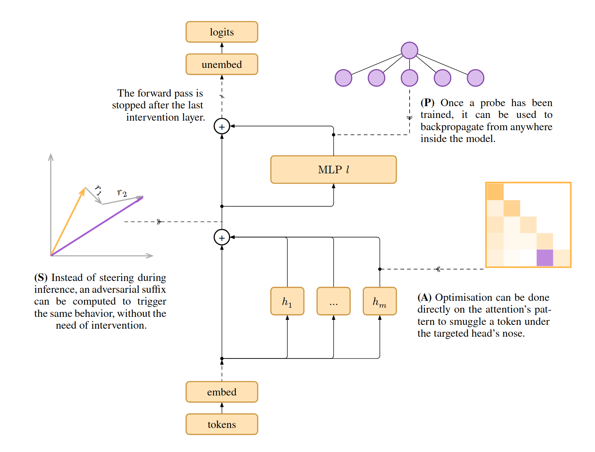

<div align="center">

# Subspace Rerouting
<div></div>

</div>


## Installation
⚠️ The project needs **Python 3.12** ⚠️

1. **Install the environment**
    <details>
    <summary>With miniconda (recommended way)</summary>
    Install miniconda: 

    ```shell
    mkdir -p ~/miniconda3
    wget https://repo.anaconda.com/miniconda/Miniconda3-latest-Linux-x86_64.sh -O ~/miniconda3/miniconda.sh
    bash ~/miniconda3/miniconda.sh -b -u -p ~/miniconda3
    rm -rf ~/miniconda3/miniconda.sh
    ~/miniconda3/bin/conda init bash
    ```

    Source or reload your shell:
    ```shell
    source ~/.bashrc
    ```

    Create the environment for SSR with python3.12:
    ```shell
    conda create -n ssr python=3.12 -y
    conda activate ssr
    ```
    </details>

    <details>
    <summary>With python venv</summary>
    ```shell 
    python -m venv .venv 
    source .venv/bin/activate
    ```
    </details>

    <br />

2. **Install dependencies**
    ```shell
    pip install poetry 
    poetry install
    ```

    Other dependencies:
    <details>
    <summary>Evaluation (Optional)</summary>

    Main libraries: `openai`, `ollama` and `google-genai`. These libraries are used in `ssr/evaluation.py` to call APIs. I'm using LMStudio, which you can install here: <https://lmstudio.ai/download>. However, any *OpenAI*-compatible API can work. To modify the APIs, directly change the `ssr/evaluation.py` script. 

    ```shell
    poetry install --with api
    ```
    </details>

    <details>
    <summary>Experiments (Optional)</summary>

    Main libraries: `jupyter`, `matplotlib`, and `plotly`. Used in `reproduce_experiments/**/*.ipynb`. Install this group if you want to reproduce the experiments provided in the notebooks. 

    If you are using VSCode, I recommend: 
    - The following extension: <https://marketplace.visualstudio.com/items?itemName=ms-toolsai.jupyter>. 
    - The following setting: `"jupyter.notebookFileRoot": "${workspaceFolder}"`, to access the `ssr` module from anywhere in the project (VSCode settings: <https://code.visualstudio.com/docs/editor/settings>).
    ```shell
    poetry install --with notebook
    ```
    </details>

    <details>
    <summary>Developpement (Optional)</summary>

    Main libraries: `mypy` and `ruff`. Install this group if you want type-checking and formatting. If you are using VSCode, you can install the following extensions: 
    - Mypy Type Checker: <https://marketplace.visualstudio.com/items?itemName=ms-python.mypy-type-checker>
    - MyPyright: <https://marketplace.visualstudio.com/items?itemName=mashin.mypyright>
    - Pylance: <https://marketplace.visualstudio.com/items?itemName=ms-python.vscode-pylance>
    - Ruff: <https://marketplace.visualstudio.com/items?itemName=charliermarsh.ruff>


    ```shell
    poetry install --with dev
    mypy --install-types
    ```
    </details>

    <details>
    <summary>Reproduce GCG baseline (Optional)</summary>

    Main libraries: `nanogcg` and `bitsandbytes`. Is used in `reproduce_results/gcg/generate.py`. Install this group if you want to generate the baseline GCG attacks. See [nanoGCG baseline](#nanogcg-baseline) for more information. 

    ```shell
    poetry install --with nanogcg
    ```
    </details>


3. **Add tokens**
    <details>
    <summary>Hugging Face</summary>

    The model used are gated ones from HuggingFace, thus a token is mandatory to access them. You can get a token from your profile page: <https://huggingface.co/settings/profile>, and then ask to have access to the desired models directly on their page: 
    - Gemma 2 2b: <https://huggingface.co/google/gemma-2-2b-it>
    - Llama 3.2 1b & 3b: <https://huggingface.co/meta-llama/Llama-3.2-3B-Instruct> 
    - Qwen2.5 does not require token


    Create a `.env` file and add the tokens: 
    ```toml
    HF_TOKEN="hf_Y3JvaXNzYW50LWNyb2lzc2FudC1jcm9pc3NhbnQ="
    ```
    </details>

    <details>
    <summary>Google API (Optional)</summary>

    To evaluate the attempts with Gemini-as-a-judge, a token from Gemini's API has to be provided, more information in the [evaluation section](#evaluation). You can get a token at: <https://aistudio.google.com>.

    Add the token to your `.env` file:
    ```toml
    GOOGLE_API_KEY="c2VjcmV0cy1pbi10aGUtcmVhZG1lLWdvZXMtYnJycg="
    ```
    </details>


## Reproduce experiments 


<details>
<summary>Introduction to the project</summary>

`reproduce_experiments/using_lens.ipynb`

> TODO 
</details>


<details>
<summary>Component attribution</summary>

`reproduce_experiments/component_attribution.ipynb`

> TODO 
</details>


<details>
<summary>Layer differences</summary>

`reproduce_experiments/layer_diffs.ipynb`

> TODO 
</details>

<details>
<summary>Evaluation</summary>

`reproduce_experiments/run_ssr/`

> TODO 
</details>

<details>
<summary>nanoGCG baseline</summary>

To reproduce the nanoGCG baseline, first make sure you have installed the optional dependencies `poetry install --with nanogcg`. To run the attacks, you can either use a config file: 

```shell
python reproduce_experiments/gcg/generate.py --config reproduce_experiments/gcg/configs/llama3.2_1b.toml 
```

Or use command line arguments: 

```shell
python reproduce_experiments/gcg/generate.py --model_name "meta-llama/Llama-3.2-3B-Instruct" --num_steps 32 
```

The only mandatory argument is the `model_name`. Go to the original repository: <https://github.com/GraySwanAI/nanoGCG> for more information. 
</details>

## Generated datasets
Generated jailbreaks are stored in `generated_jailbreaks/`, for the moment in JSON line format. I chose JSON line as a practical solution for storing experiences. This way, each line is self-sufficient, all the information is grouped together, and there's no need to go back and forth to other files. Lines can be load either with `load_jsonl: str (filepath) -> List[dict]` (in `ssr/__init__.py`), or `load_attempts_jsonl: str (filepath) -> Attempt` (in `ssr.evaluation.py`).

Attempt structure: 
```python
{
    model_name: str                             # name of the model being attacked 
    instruction: str                            # vanilla harmful instruction ("How to create a bomb?")
    suffix: str                                 # suffix generated by the SSR attack 

    inital_loss: float      
    final_loss: float
    duration: int                               # attack duration in seconds 

    config: ProbeSSRConfig | SteeringSSRConfig | AttentionSSRConfig     # attack config

    responses: List[{
        model_name: str                         # name of the model being requested via API 
                                                # (usually the same as the target)
        response: str                               
        bow: str                                # score given by harmful_bow() (see ssr/evaluation.py)

        
        system_message: Optional[str] = None    # if None: the chat template without system instructions

        guard: Optional[bool] = None            # llm guard (Llama-guard-3)
        judge: Optional[JudgeScore] = None      # score given by LLM-as-a-judge (Gemini) 
                                                # (see ssr/templates/judge.jinja2)
        human: Optional[int] = None             # score given by human verification  
    }]
}
```

## TODO 
- Hijack score experiments cleaning
- More jailbreaks 
- clean dataset with just jailbreak + suffix 
- clean API config